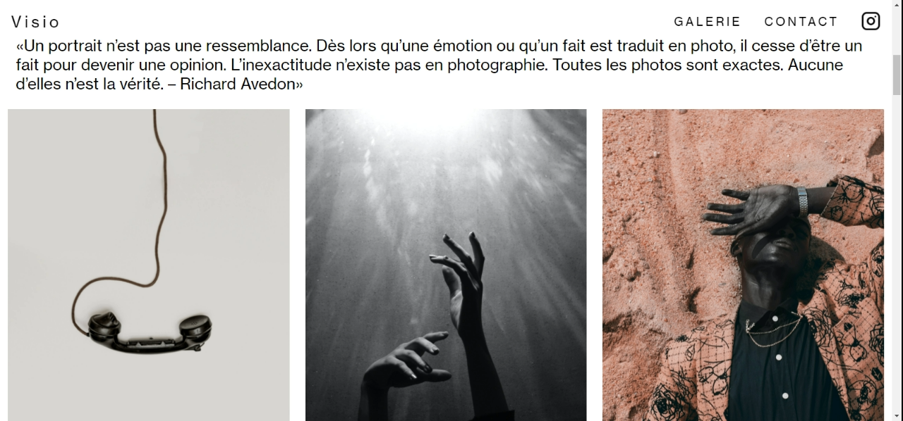
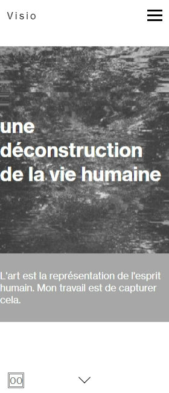
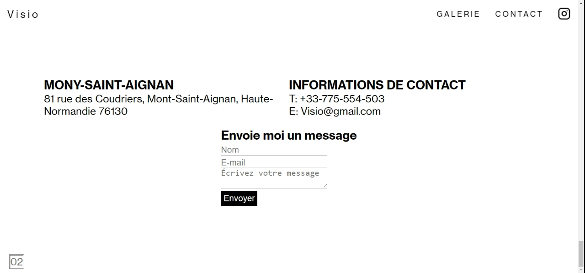
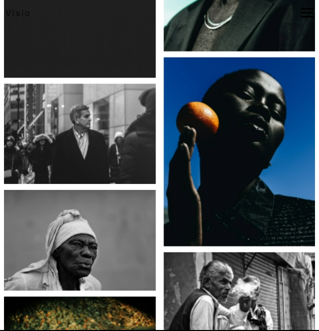

# Visio-app
A landpage for a french photographer to display his body of work to the world.

- Created using React

## Features

- Features a clean minimalistic UI
- Gallery of photos
- Responsive design

## Available Scripts

In the project directory, you can run:

### `npm start`

Runs the app in the development mode.\
Open [http://localhost:3000](http://localhost:3000) to view it in the browser.

The page will reload if you make edits.\
You will also see any lint errors in the console.
### More pictures

## License

MIT

**Free Software, Hell Yeah!**
